## 🛒 MultiShop

MultiShop, .NET teknolojileriyle geliştirilmiş mikro servis mimarisine sahip bir e-ticaret uygulamasıdır.  
Ocelot API Gateway ve Identity Server kullanılarak kimlik doğrulama ve servisler arası geçiş yönetilirken, her modül bağımsız olarak yapılandırılmıştır.  
Proje, servislerin **loosely coupled (gevşek bağlı)** olması prensibiyle geliştirilmiştir.

## 🚀 Temel Özellikler

- Microservice tabanlı yapı
- Ocelot ile API Gateway yönetimi
- Identity Server ile kimlik doğrulama ve yetkilendirme
- Entity Framework Core ile veritabanı işlemleri
- SOLID prensipleriyle kodlama

## ⚙️ Kullanılan Teknolojiler

- ASP.NET Core Web API  
- Ocelot API Gateway  
- Identity Server 
- Entity Framework Core  
- SQL Server  
- AutoMapper  
- FluentValidation  
- Swagger  
- Postman
- Docker
- Portainer (Container UI yönetimi)  

## 📸 Proje Resimleri

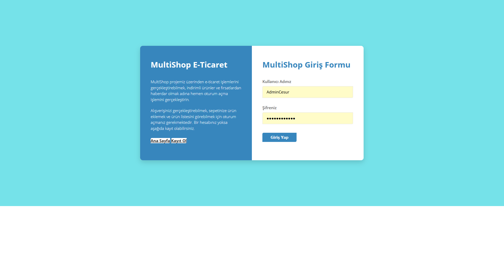

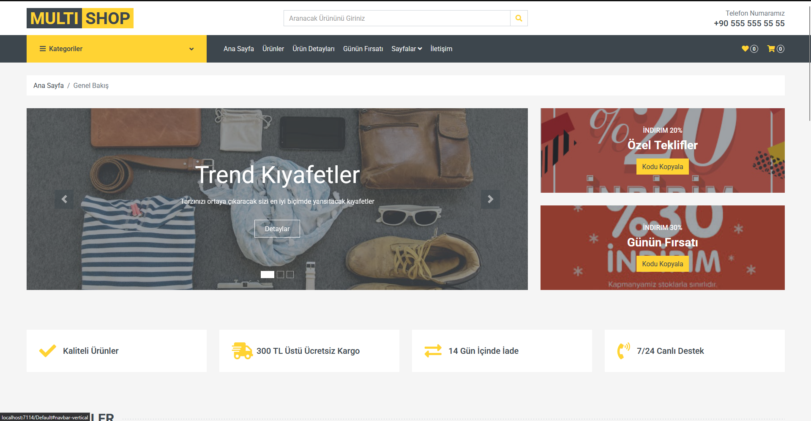

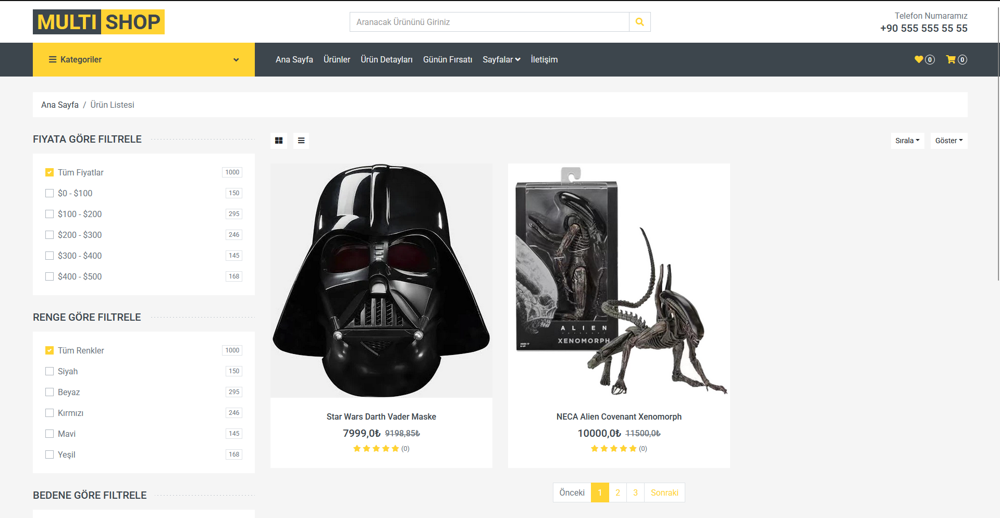

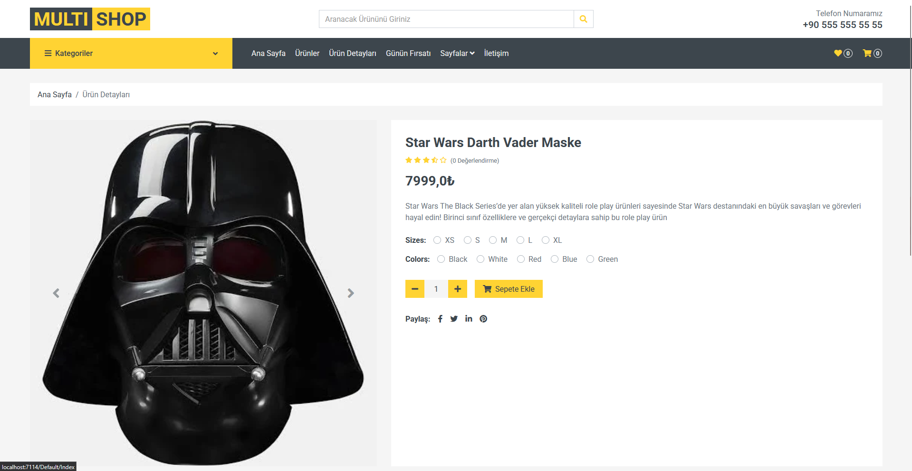

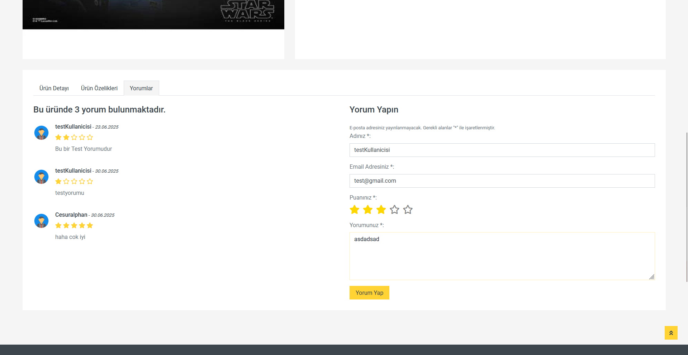

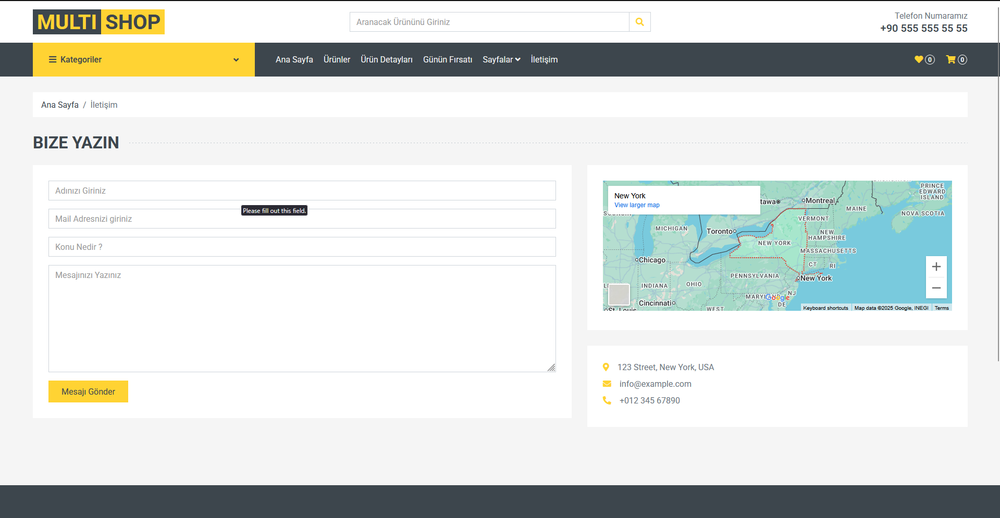

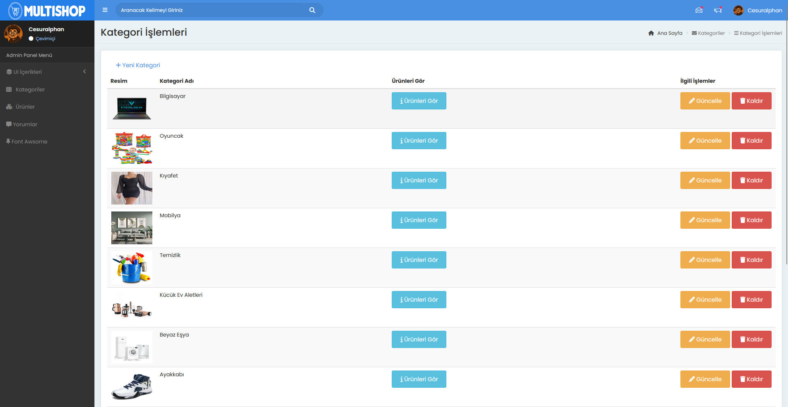

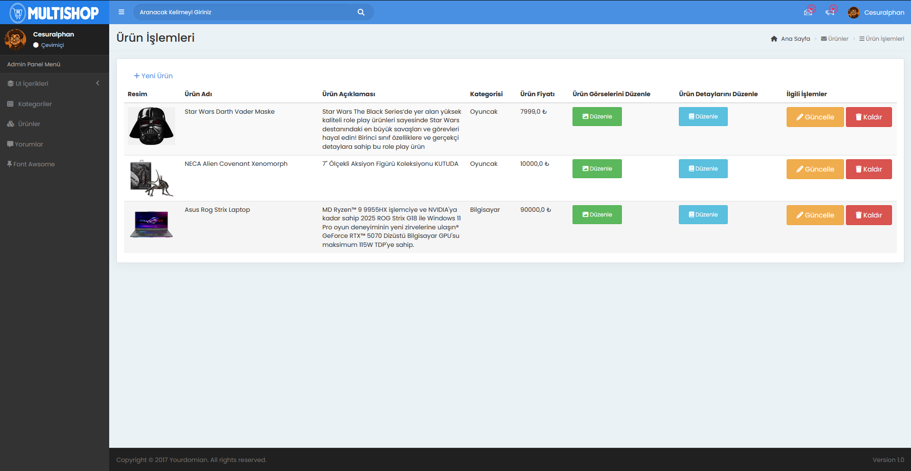

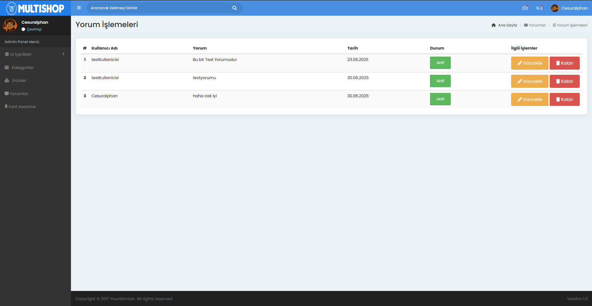

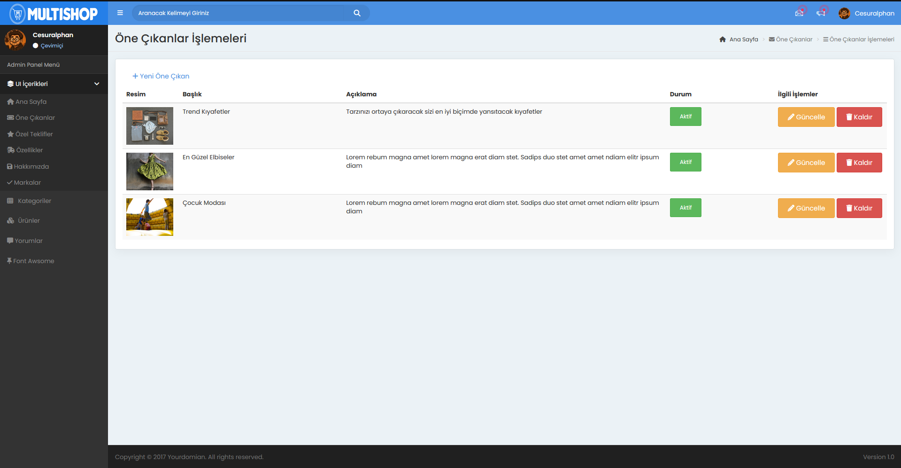

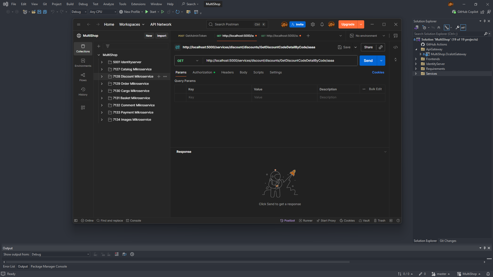

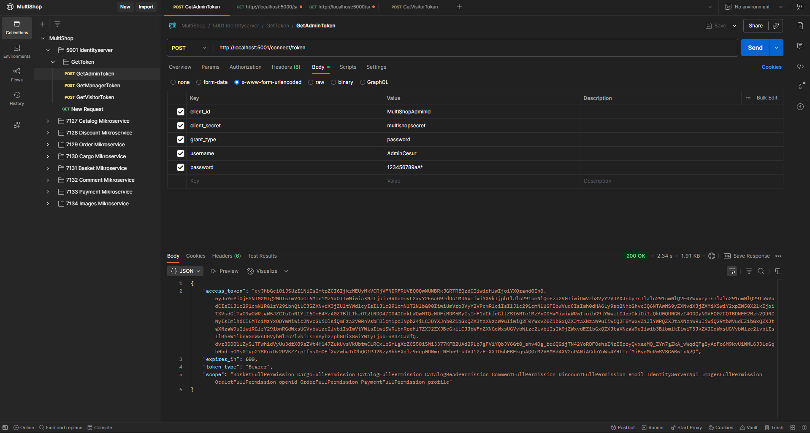

## 📁 Proje Yapısı

```text
MultiShop
│
├── Services
│   ├── MultiShop.Catalog
│   ├── MultiShop.Product
│   ├── MultiShop.Category
│   └── MultiShop.Detail
│
├── ApiGateway
│   └── MultiShop.OcelotGateway
│
├── IdentityServer
│   └── MultiShop.IdentityServer
